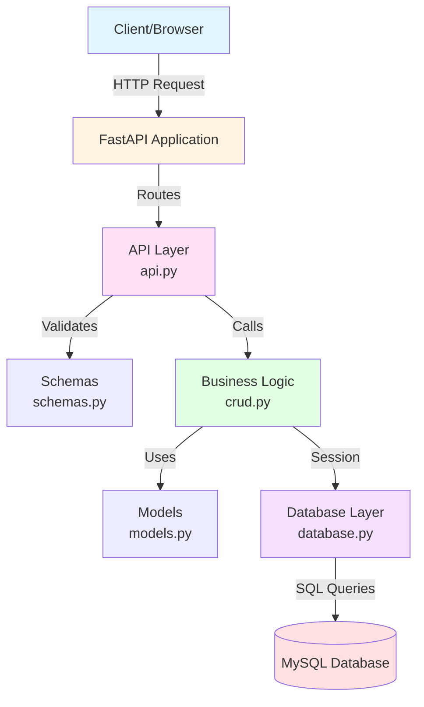
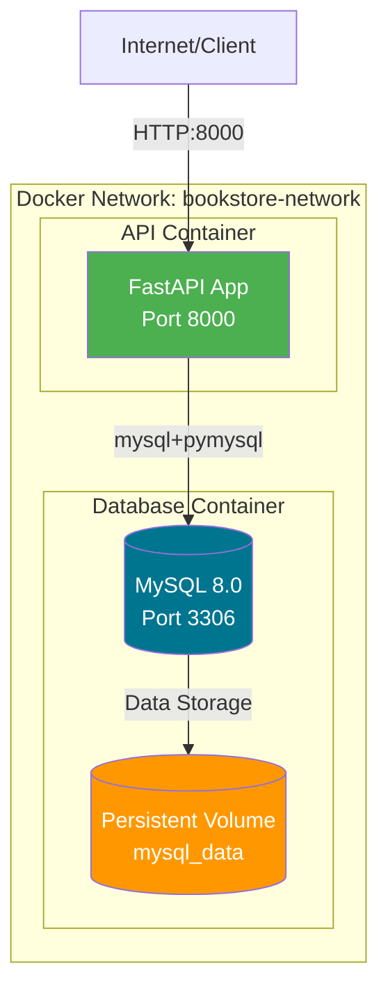
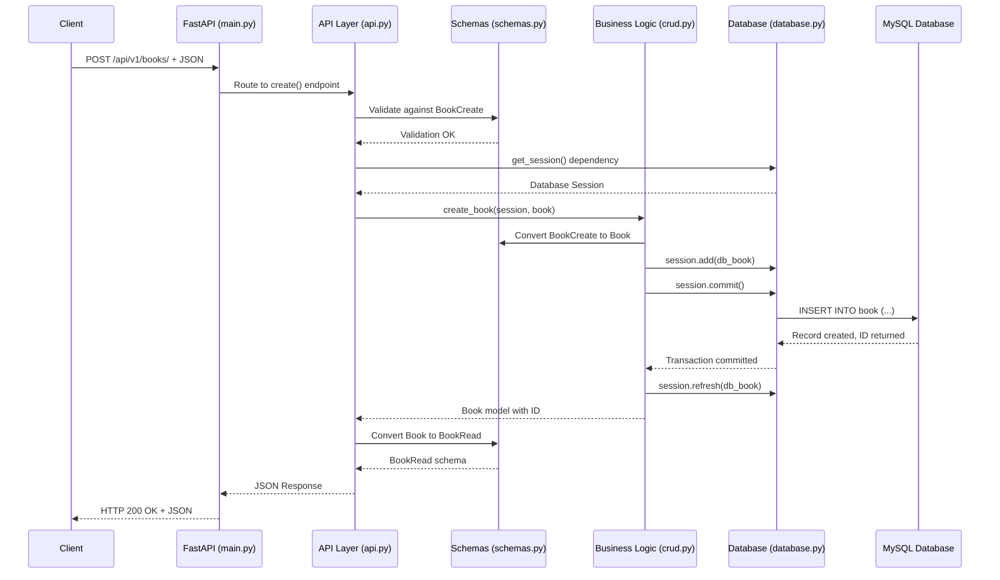
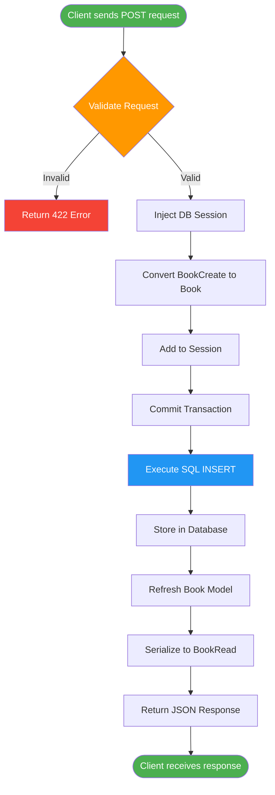
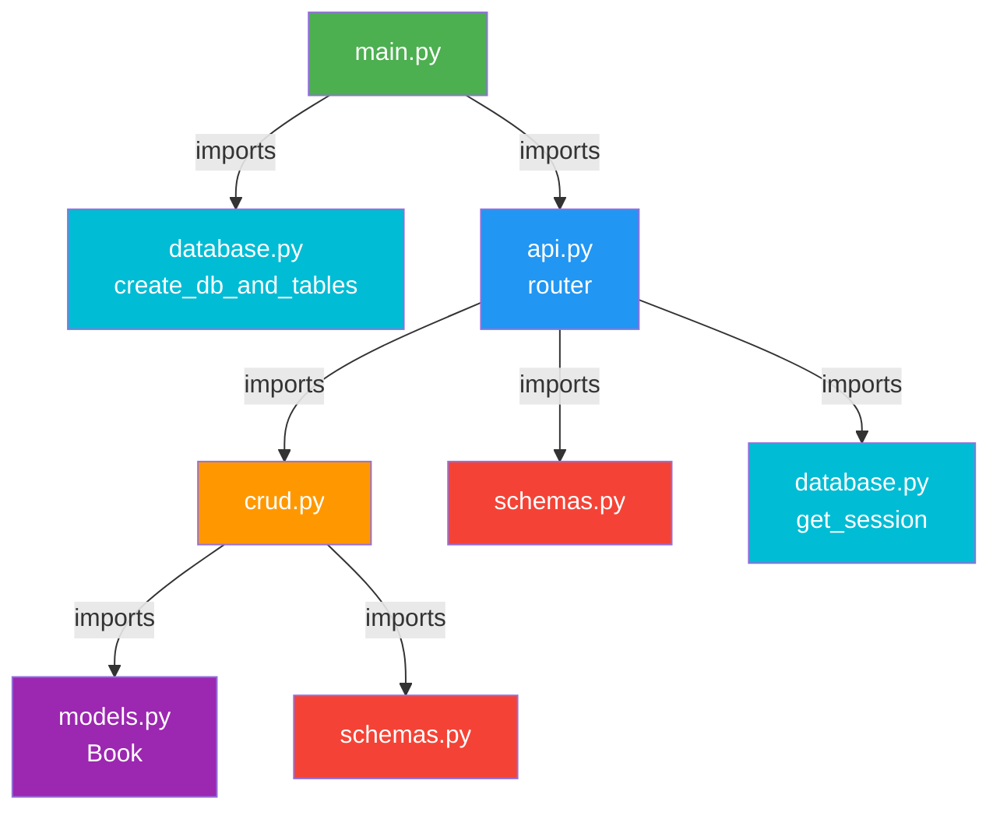

# Building a Scalable FastAPI Application with SQLModel: A Complete Guide to Three-Layer Architecture

*Learn how to build a production-ready REST API using FastAPI and SQLModel, following clean architecture principles*

---

## Introduction

FastAPI has become one of the most popular Python web frameworks for building APIs, thanks to its speed, automatic documentation, and type safety. When combined with SQLModel (which merges SQLAlchemy and Pydantic), you get a powerful stack for building robust, type-safe APIs.

In this article, we'll explore a complete BookStore API implementation that demonstrates:
- **Three-layer architecture** for clean separation of concerns
- **Request flow** from client to database and back
- **Project structure** that scales
- **Deployment strategies** for production

Let's dive in!

---

## Project Overview

Our BookStore API provides CRUD operations for managing books. It's built with:
- **FastAPI** - Modern, fast web framework
- **SQLModel** - Combines SQLAlchemy ORM + Pydantic validation
- **SQLite/MySQL** - Database options
- **Python 3.12+** - Modern Python features

---

## Project Structure

```
fastapi-sqlmodel-app/
├── app/
│   ├── __init__.py
│   ├── main.py          # Application entry point
│   ├── api.py            # API routes (Presentation Layer)
│   ├── crud.py           # Business logic (Service Layer)
│   ├── models.py         # Database models
│   ├── schemas.py        # Request/Response validation
│   └── database.py       # Database configuration
├── .env                  # Environment variables
├── requirements.txt      # Dependencies
├── Dockerfile           # Docker image configuration
├── docker-compose.yml   # Docker Compose configuration
├── .dockerignore        # Files to exclude from Docker build
└── README.md
```

This structure follows the **separation of concerns** principle, making the codebase maintainable and testable.

---

## Three-Layer Architecture

Our application follows a **three-layer architecture** pattern:

### 1. Presentation Layer (`api.py`)
**Responsibility**: Handle HTTP requests and responses

This layer:
- Defines REST API endpoints
- Validates incoming requests using Pydantic schemas
- Handles HTTP status codes and errors
- Converts responses to JSON

```python
# app/api.py
from fastapi import APIRouter, Depends, HTTPException
from sqlmodel import Session
from .crud import create_book, get_book, get_books
from .schemas import BookCreate, BookRead
from .database import get_session

router = APIRouter()

@router.post("/books/", response_model=BookRead)
def create(book: BookCreate, session: Session = Depends(get_session)):
    """Create a new book."""
    return create_book(session, book)

@router.get("/books/{book_id}", response_model=BookRead)
def read(book_id: int, session: Session = Depends(get_session)):
    """Get a single book by ID."""
    book = get_book(session, book_id)
    if not book:
        raise HTTPException(status_code=404, detail="Book not found")
    return book
```

### 2. Business Logic Layer (`crud.py`)
**Responsibility**: Implement core business operations

This layer:
- Contains all database operations
- Handles data transformation
- Manages transactions
- Implements business rules

```python
# app/crud.py
from sqlmodel import Session, select
from .models import Book
from .schemas import BookCreate, BookUpdate

def create_book(session: Session, book: BookCreate) -> Book:
    """Create a new Book in the database."""
    db_book = Book.from_orm(book)
    session.add(db_book)
    session.commit()
    session.refresh(db_book)
    return db_book

def get_books(session: Session, offset: int = 0, limit: int = 10):
    """Return a paginated list of books."""
    statement = select(Book).offset(offset).limit(limit)
    return session.exec(statement).all()

def update_book(session: Session, book_id: int, book_data: BookUpdate):
    """Apply partial update to a Book."""
    db_book = session.get(Book, book_id)
    if not db_book:
        return None
    
    # Only update provided fields
    for key, value in book_data.dict(exclude_unset=True).items():
        setattr(db_book, key, value)
    
    db_book.update_timestamp()
    session.add(db_book)
    session.commit()
    session.refresh(db_book)
    return db_book
```

### 3. Data Access Layer (`models.py` + `database.py`)
**Responsibility**: Database models and connection management

This layer:
- Defines database schema
- Manages database connections
- Provides session management
- Handles table creation

```python
# app/models.py
from sqlmodel import SQLModel, Field
from datetime import datetime
from typing import Optional

class BookBase(SQLModel):
    """Base fields shared by all Book representations."""
    title: str = Field(index=True)
    author: str = Field(index=True)
    year: int
    price: float
    in_stock: bool = True
    description: Optional[str] = None
    created_at: datetime = Field(default_factory=datetime.utcnow)
    updated_at: datetime = Field(default_factory=datetime.utcnow)

class Book(BookBase, table=True):
    """Database table representation."""
    id: Optional[int] = Field(default=None, primary_key=True)
    
    def update_timestamp(self):
        self.updated_at = datetime.utcnow()
```

```python
# app/database.py
from sqlmodel import SQLModel, create_engine, Session
from dotenv import load_dotenv
import os

load_dotenv()
DATABASE_URL = os.getenv("DATABASE_URL", "sqlite:///./test.db")

engine = create_engine(DATABASE_URL, echo=True)

def create_db_and_tables():
    """Create all tables defined on SQLModel metadata."""
    SQLModel.metadata.create_all(engine)

def get_session():
    """FastAPI dependency that yields a database session."""
    with Session(engine) as session:
        yield session
```

---

## Architecture Diagrams

### System Architecture (Mermaid)



### Network Architecture (Mermaid)



---

## Request Flow: From Client to Database

Let's trace a complete request flow when creating a book:

### Sequence Diagram (Mermaid)



### Request Flow Diagram (Mermaid)



### Visual Architecture Diagram

```
                    ┌──────────────┐
                    │   Client     │
                    │ (Browser/API)│
                    └──────┬───────┘
                           │ HTTP Request
                           ↓
        ┌──────────────────────────────────────┐
        │      Presentation Layer (api.py)     │
        │  • Route handling                    │
        │  • Request validation (schemas.py)  │
        │  • Response formatting              │
        │  • Error handling                   │
        └──────────────┬───────────────────────┘
                       │
                       │ Calls CRUD functions
                       ↓
        ┌──────────────────────────────────────┐
        │   Business Logic Layer (crud.py)    │
        │  • create_book()                     │
        │  • get_book()                       │
        │  • update_book()                    │
        │  • delete_book()                    │
        │  • Data transformation              │
        └──────────────┬───────────────────────┘
                       │
                       │ Uses models & session
                       ↓
        ┌──────────────────────────────────────┐
        │    Data Access Layer                 │
        │  • models.py (Book model)            │
        │  • database.py (Session, Engine)    │
        └──────────────┬───────────────────────┘
                       │
                       │ SQL Queries
                       ↓
        ┌──────────────────────────────────────┐
        │         Database                     │
        │    (SQLite / MySQL)                  │
        └──────────────────────────────────────┘
```

### Detailed Architecture Flow

```
╔══════════════════════════════════════════════════════════════════════════════╗
║                    FASTAPI-SQLMODEL APPLICATION ARCHITECTURE                 ║
╚══════════════════════════════════════════════════════════════════════════════╝

┌─────────────────────────────────────────────────────────────────────────────┐
│                           CLIENT LAYER                                       │
│                    (HTTP Client / Browser / Postman)                         │
└───────────────────────────────┬─────────────────────────────────────────────┘
                                │
                                │ HTTP Requests (GET, POST, PUT, DELETE)
                                │
                                ↓
┌─────────────────────────────────────────────────────────────────────────────┐
│                        APPLICATION LAYER                                     │
│                              main.py                                         │
│  ┌─────────────────────────────────────────────────────────────────────┐   │
│  │ • FastAPI App Initialization                                        │   │
│  │ • Environment Variable Loading (.env)                               │   │
│  │ • Router Registration (/api/v1)                                     │   │
│  │ • Startup Event: create_db_and_tables()                             │   │
│  └─────────────────────────────────────────────────────────────────────┘   │
└───────────────────────────────┬─────────────────────────────────────────────┘
                                │
                                │ includes router
                                │
                                ↓
┌─────────────────────────────────────────────────────────────────────────────┐
│                         PRESENTATION LAYER                                   │
│                              api.py                                          │
│  ┌─────────────────────────────────────────────────────────────────────┐   │
│  │  Endpoints:                                                           │   │
│  │  • POST   /api/v1/books/      → create()                             │   │
│  │  • GET    /api/v1/books/      → read_all()                           │   │
│  │  • GET    /api/v1/books/{id}  → read()                               │   │
│  │  • PUT    /api/v1/books/{id}  → update()                             │   │
│  │  • DELETE /api/v1/books/{id}  → delete()                             │   │
│  │                                                                       │   │
│  │  Dependencies:                                                        │   │
│  │  • Depends(get_session) → database.py                               │   │
│  │  • BookCreate/BookRead/BookUpdate → schemas.py                       │   │
│  └─────────────────────────────────────────────────────────────────────┘   │
└───────────────┬───────────────────────────────┬─────────────────────────────┘
                │                               │
                │ calls CRUD functions          │ validates with schemas
                │                               │
                ↓                               ↓
┌───────────────────────────────┐   ┌──────────────────────────────────────────┐
│    BUSINESS LOGIC LAYER       │   │      VALIDATION LAYER                    │
│          crud.py              │   │         schemas.py                       │
│  ┌─────────────────────────┐  │   │  ┌────────────────────────────────────┐ │
│  │ • create_book()         │  │   │  │ • BookCreate (request)             │ │
│  │ • get_book()            │  │   │  │ • BookRead (response)              │ │
│  │ • get_books()           │  │   │  │ • BookUpdate (partial update)      │ │
│  │ • update_book()         │  │   │  │ • BookSearchResults (pagination)   │ │
│  │ • delete_book()         │  │   │  └────────────────────────────────────┘ │
│  └─────────────────────────┘  │   └──────────────────────────────────────────┘
│                                │
│  Uses:                         │
│  • Book model (models.py)      │
│  • Session (database.py)       │
│  • BookCreate/BookUpdate       │
└───────────────┬────────────────┘
                │
                │ uses Book model
                │
                ↓
┌─────────────────────────────────────────────────────────────────────────────┐
│                         DATA ACCESS LAYER                                    │
│  ┌──────────────────────────────┐  ┌──────────────────────────────────────┐ │
│  │        models.py             │  │        database.py                   │ │
│  │  ┌────────────────────────┐  │  │  ┌────────────────────────────────┐ │ │
│  │  │ • BookBase             │  │  │  │ • engine (SQLAlchemy)          │ │ │
│  │  │   - title, author      │  │  │  │ • create_db_and_tables()       │ │ │
│  │  │   - year, price        │  │  │  │ • get_session() (dependency)   │ │ │
│  │  │   - in_stock           │  │  │  └────────────────────────────────┘ │ │
│  │  │   - timestamps         │  │  │                                     │ │
│  │  │                        │  │  │  Creates tables from:              │ │
│  │  │ • Book (table=True)    │  │  │  SQLModel.metadata (from models)   │ │
│  │  │   - id (PK)            │  │  │                                     │ │
│  │  │   - update_timestamp() │  │  │  Provides sessions to:             │ │
│  │  └────────────────────────┘  │  │  api.py → crud.py                  │ │
│  └──────────────────────────────┘  └──────────────────────────────────────┘ │
└───────────────────────────────┬─────────────────────────────────────────────┘
                                │
                                │ SQL Queries
                                │
                                ↓
┌─────────────────────────────────────────────────────────────────────────────┐
│                           DATABASE LAYER                                     │
│                    SQLite (default) or MySQL                                 │
│  ┌─────────────────────────────────────────────────────────────────────┐   │
│  │  Table: book                                                        │   │
│  │  • id (INTEGER PRIMARY KEY)                                          │   │
│  │  • title (TEXT, indexed)                                             │   │
│  │  • author (TEXT, indexed)                                            │   │
│  │  • year (INTEGER)                                                    │   │
│  │  • price (REAL)                                                      │   │
│  │  • in_stock (BOOLEAN)                                                │   │
│  │  • description (TEXT, nullable)                                      │   │
│  │  • created_at (DATETIME)                                             │   │
│  │  • updated_at (DATETIME)                                             │   │
│  └─────────────────────────────────────────────────────────────────────┘   │
└─────────────────────────────────────────────────────────────────────────────┘
```

---

## Key Components Explained

### 1. Models (`models.py`)

SQLModel combines Pydantic validation with SQLAlchemy ORM. The `table=True` parameter makes it a database table:

```python
class Book(BookBase, table=True):
    id: Optional[int] = Field(default=None, primary_key=True)
```

**Key Points:**
- `BookBase` contains shared fields (reusable)
- `table=True` registers the model in `SQLModel.metadata`
- On startup, `create_db_and_tables()` reads metadata and creates tables
- The metadata connection happens automatically through Python's import system

### 2. Schemas (`schemas.py`)

Schemas define API contracts:

- **BookCreate**: Request payload (no `id`, no timestamps)
- **BookRead**: Response format (includes all fields)
- **BookUpdate**: Partial updates (all fields optional)

### 3. Dependency Injection

FastAPI's `Depends()` injects database sessions:

```python
def create(book: BookCreate, session: Session = Depends(get_session)):
    # session is automatically provided by FastAPI
    return create_book(session, book)
```

This ensures:
- Each request gets a fresh session
- Sessions are properly closed after request
- Easy to mock for testing

### 4. Metadata Connection

How `create_db_and_tables()` connects with models:

1. When `models.py` is imported, classes with `table=True` automatically register in `SQLModel.metadata`
2. `SQLModel.metadata` is a global registry shared across all modules
3. `create_db_and_tables()` reads from this registry and creates all registered tables
4. No explicit connection needed - it works through Python's import system

---

## Deployment Process

### Local Development

#### Option A: Using Docker Compose (Recommended)

1. **Start Services**

```bash
# Build and start all services (API + MySQL)
docker-compose up -d

# View logs
docker-compose logs -f api

# Stop services
docker-compose down
```

Access:
- API: `http://127.0.0.1:8000`
- Swagger UI: `http://127.0.0.1:8000/docs`
- ReDoc: `http://127.0.0.1:8000/redoc`

#### Option B: Local Python Environment

1. **Setup Environment**

```bash
# Create virtual environment
python3 -m venv venv
source venv/bin/activate  # On Windows: venv\Scripts\activate

# Install dependencies
pip install -r requirements.txt
```

2. **Configure Environment Variables**

Create `.env` file:

```env
DATABASE_URL=sqlite:///./test.db
API_TITLE=BookStore API
API_VERSION=1.0.0
ROOT_PATH=/
```

3. **Run Application**

```bash
uvicorn app.main:app --reload
```

Access:
- API: `http://127.0.0.1:8000`
- Swagger UI: `http://127.0.0.1:8000/docs`
- ReDoc: `http://127.0.0.1:8000/redoc`

### Production Deployment Options

#### Option 1: Docker Deployment (Recommended)

**Dockerfile:**

```dockerfile
FROM python:3.12-slim

# Set working directory
WORKDIR /app

# Set environment variables
ENV PYTHONDONTWRITEBYTECODE=1 \
    PYTHONUNBUFFERED=1

# Install system dependencies
RUN apt-get update && \
    apt-get install -y --no-install-recommends \
    gcc \
    && rm -rf /var/lib/apt/lists/*

# Copy requirements file
COPY requirements.txt .

# Install Python dependencies
RUN pip install --no-cache-dir --upgrade pip && \
    pip install --no-cache-dir -r requirements.txt

# Copy application code
COPY app/ ./app/

# Expose port
EXPOSE 8000

# Health check
HEALTHCHECK --interval=30s --timeout=10s --start-period=5s --retries=3 \
    CMD python -c "import urllib.request; urllib.request.urlopen('http://localhost:8000/')" || exit 1

# Run the application
CMD ["uvicorn", "app.main:app", "--host", "0.0.0.0", "--port", "8000"]
```

**docker-compose.yml:**

```yaml
version: '3.8'

services:
  # FastAPI Application
  api:
    build:
      context: .
      dockerfile: Dockerfile
    container_name: fastapi-bookstore-api
    ports:
      - "8000:8000"
    environment:
      - DATABASE_URL=mysql+pymysql://bookstore_user:bookstore_password@db:3306/bookstore_db
      - API_TITLE=BookStore API
      - API_VERSION=1.0.0
      - ROOT_PATH=/
    depends_on:
      db:
        condition: service_healthy
    volumes:
      - ./app:/app/app
    restart: unless-stopped
    networks:
      - bookstore-network

  # MySQL Database
  db:
    image: mysql:8.0
    container_name: fastapi-bookstore-db
    environment:
      - MYSQL_ROOT_PASSWORD=root_password
      - MYSQL_DATABASE=bookstore_db
      - MYSQL_USER=bookstore_user
      - MYSQL_PASSWORD=bookstore_password
    ports:
      - "3306:3306"
    volumes:
      - mysql_data:/var/lib/mysql
    healthcheck:
      test: ["CMD", "mysqladmin", "ping", "-h", "localhost", "-u", "root", "-proot_password"]
      interval: 10s
      timeout: 5s
      retries: 5
    restart: unless-stopped
    networks:
      - bookstore-network

volumes:
  mysql_data:
    driver: local

networks:
  bookstore-network:
    driver: bridge
```

**Deploy:**

```bash
# Build and start all services
docker-compose up -d

# View logs
docker-compose logs -f

# Stop services
docker-compose down

# Stop and remove volumes
docker-compose down -v
```

Once deployed, access:
- API: `http://127.0.0.1:8000`
- Swagger UI: `http://127.0.0.1:8000/docs`
- API Endpoints: `http://127.0.0.1:8000/api/v1/books/`

#### Option 2: Cloud Platform (AWS/GCP/Azure)

**Using AWS Elastic Beanstalk:**

1. Install EB CLI:
```bash
pip install awsebcli
```

2. Initialize:
```bash
eb init -p python-3.12 fastapi-app
eb create fastapi-env
```

3. Deploy:
```bash
eb deploy
```

**Using Google Cloud Run:**

```bash
# Build container
gcloud builds submit --tag gcr.io/PROJECT_ID/fastapi-app

# Deploy
gcloud run deploy fastapi-app \
  --image gcr.io/PROJECT_ID/fastapi-app \
  --platform managed \
  --region us-central1 \
  --allow-unauthenticated
```

#### Option 3: Traditional Server (Nginx + Gunicorn)

**Install Gunicorn:**

```bash
pip install gunicorn
```

**Create Gunicorn config (`gunicorn_config.py`):**

```python
bind = "0.0.0.0:8000"
workers = 4
worker_class = "uvicorn.workers.UvicornWorker"
timeout = 120
keepalive = 5
```

**Run with Gunicorn:**

```bash
gunicorn app.main:app -c gunicorn_config.py
```

**Nginx Configuration:**

```nginx
server {
    listen 80;
    server_name your-domain.com;

    location / {
        proxy_pass http://127.0.0.1:8000;
        proxy_set_header Host $host;
        proxy_set_header X-Real-IP $remote_addr;
        proxy_set_header X-Forwarded-For $proxy_add_x_forwarded_for;
    }
}
```

---

## Testing the API

### Using Swagger UI

Navigate to `http://127.0.0.1:8000/docs` and interact with the API directly.

### Using cURL

**Create a book:**

```bash
curl -X POST "http://127.0.0.1:8000/api/v1/books/" \
  -H "Content-Type: application/json" \
  -d '{
    "title": "The Great Gatsby",
    "author": "F. Scott Fitzgerald",
    "year": 1925,
    "price": 10.99,
    "in_stock": true
  }'
```

**Get all books:**

```bash
curl -X GET "http://127.0.0.1:8000/api/v1/books/"
```

**Get a specific book:**

```bash
curl -X GET "http://127.0.0.1:8000/api/v1/books/1"
```

**Update a book:**

```bash
curl -X PUT "http://127.0.0.1:8000/api/v1/books/1" \
  -H "Content-Type: application/json" \
  -d '{
    "price": 15.99,
    "in_stock": false
  }'
```

**Delete a book:**

```bash
curl -X DELETE "http://127.0.0.1:8000/api/v1/books/1"
```

---

## Best Practices Implemented

### 1. **Separation of Concerns**
Each layer has a single responsibility, making the code maintainable.

### 2. **Type Safety**
SQLModel provides type hints throughout, catching errors at development time.

### 3. **Dependency Injection**
Database sessions are injected, making testing easier.

### 4. **Schema Validation**
Pydantic schemas validate all inputs automatically.

### 5. **Error Handling**
Proper HTTP status codes and error messages.

### 6. **Environment Configuration**
Sensitive data stored in environment variables.

### 7. **Automatic Documentation**
FastAPI generates OpenAPI/Swagger docs automatically.

---

## Extending the Application

### Adding Authentication

```python
from fastapi import Depends, HTTPException, status
from fastapi.security import OAuth2PasswordBearer

oauth2_scheme = OAuth2PasswordBearer(tokenUrl="token")

def get_current_user(token: str = Depends(oauth2_scheme)):
    # Validate token and return user
    pass

@router.post("/books/", response_model=BookRead)
def create(
    book: BookCreate,
    session: Session = Depends(get_session),
    current_user = Depends(get_current_user)
):
    return create_book(session, book)
```

### Adding Pagination

```python
@router.get("/books/", response_model=BookSearchResults)
def read_all(
    offset: int = 0,
    limit: int = Query(default=10, le=100),
    session: Session = Depends(get_session),
):
    books = get_books(session, offset, limit)
    total = get_books_count(session)
    return BookSearchResults(
        results=books,
        total=total,
        page=offset // limit + 1,
        size=limit
    )
```

### Adding Search/Filtering

```python
def get_books_by_author(session: Session, author: str):
    statement = select(Book).where(Book.author == author)
    return session.exec(statement).all()
```

---

## File-to-File Connections

Understanding how components connect:

### Import Chain (Mermaid)



### Data Flow

1. **Client Request** → `main.py` → `api.py`
2. **Validation** → `schemas.py` validates request
3. **Dependency** → `database.py` provides session
4. **Business Logic** → `crud.py` processes request
5. **Data Access** → `models.py` interacts with database
6. **Response** → `schemas.py` formats response → Client

---

## Conclusion

This three-layer architecture provides:

✅ **Maintainability** - Clear separation of concerns  
✅ **Testability** - Each layer can be tested independently  
✅ **Scalability** - Easy to add new features  
✅ **Type Safety** - SQLModel ensures type correctness  
✅ **Documentation** - Automatic API docs  
✅ **Performance** - FastAPI is one of the fastest Python frameworks  

The architecture pattern demonstrated here can be extended to build larger applications with multiple models, authentication, caching, and more complex business logic.

---

## Resources

- [FastAPI Documentation](https://fastapi.tiangolo.com/)
- [SQLModel Documentation](https://sqlmodel.tiangolo.com/)
- [Project Repository](https://github.com/yourusername/fastapi-sqlmodel-app)

---

*Happy coding! If you found this helpful, please share and follow for more backend development content.*

